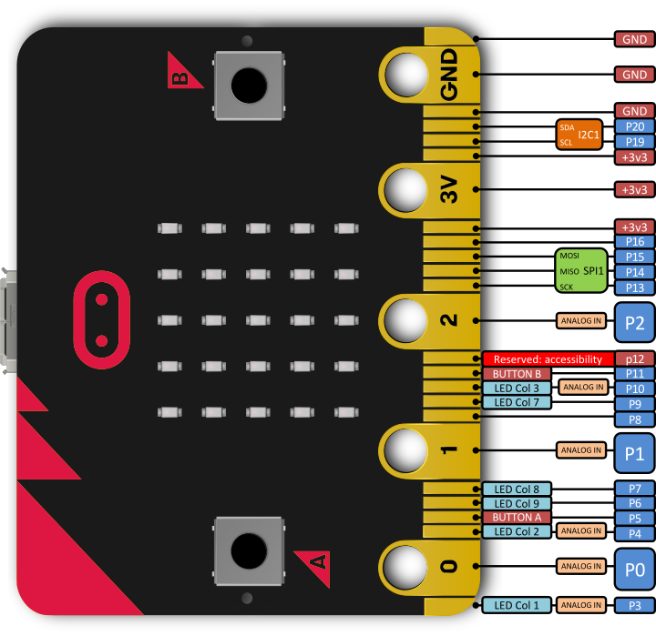

# Simple BBC micro:bit tutorials

Some introductory material on getting to know the BBC micro bit and
how to control external things from Python.

# The micro:bit connectors

The micro:bit has a lot of little connectors along the bottom edge -
some of these are big for crocodile clips and others are much smaller,
so you can push the micro:bit into a connector on another circuit
board:



For this introduction we will focus on using the pinouts 0, 1
and 2. You can use the 3V pinout to check that things work or supply
power to something which has internal circuitry.

# Simplest task: power an LED

To do this we will not even use the micro:bit for anything more than
passing power to an LED on a board, e.g. one like
[this](https://thepihut.com/collections/micro-bit-accessories/products/play-board-extras). If
you connect the (+) end of the board to the 3V connector with
crocodile clips, and the (-) end to the GND connector, the LED should
light up.

# Controlling the LED

Lighting up the LED with the micro:bit is not interesting. More
interesting is to control it from Python! So what you need to do is
move the (+) crocodile clip from the 3V connector to the 0 one: this
is something called a general purpose input / output (or GPIO) which
can either listen to a button press or control something external (but
not both at the same time, for one connector). The buttons marked A
and B are also connected to GPIO pins, as are the LEDs on the
board. From Python you access these with:

```python
import microbit
microbit.pin0
```

for connector 0. If you want to see if a button connected to this is
pressed, you _read_ from it. If you want to switch something on or
off, you _write_ to it. So, if you have your LED connected to
connector 0, you can try:

```python
import microbit
microbit.pin0.write_digital(1)
```

to switch _on_ anything connected or

```python
import microbit
microbit.pin0.write_digital(0)
```

to switch it _off_. To make the LED blink on and off, use:

```python
import microbit
import time
for j in range(60):
    microbit.pin0.write_digital(1)
    time.sleep(1)
    microbit.pin0.write_digital(0)
    time.sleep(1)
```
