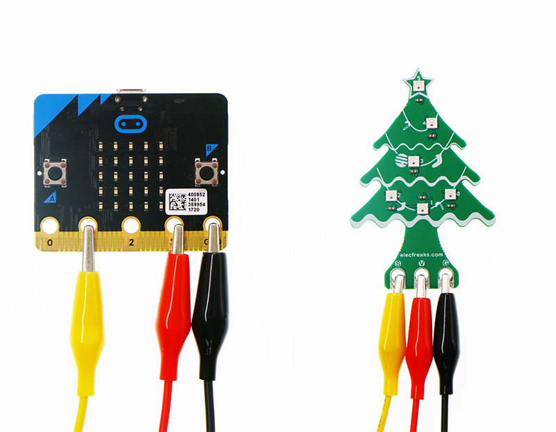

# RGB Christmas Tree

The [RGB Christmas Tree](https://thepihut.com/products/rainbow-led-christmas-tree-for-micro-bit) contains six LEDs which can change colour - these are something called "neopixels" it would seem. The six lights are connected through one GPIO connector and are called "individually addressable" - so you can control them individually. and set each of them to be a different colour or brightness.

## Basic Connections

Unlike an LED this needs _tree_ wires connecting up - one to control the power, one for controlling it and one to complete the circuit. Connect GND on micro:bit to (G) on the tree, 3V to (V) and 0 to (S) - traditionally you use red for 3V, black for GND and yellow for the signal control like:



In this one they have connected pin 1 not zero, but the idea is the same.

## Controlling

The LEDs are numbered 0, 1, 2, 3, 4 and 5 as there are six LEDs and computer people count from zero. As there are six we need to make a neopixel array with six spaces with:

```python
import neopixel
import microbit

np = neopixel.NeoPixel(microbit.pin0, 6)
```

This says that you have six LEDs connected to 0. You can control the brightness and colour by setting how bright the red, green and blue channels are - white light would be made up of them being the same. The brightness is in a range from 0 (off) to 255 (maximum brightness) so if you do:

```
```python
import neopixel
import microbit
import time

np = neopixel.NeoPixel(microbit.pin0, 6)
for j in range(10):
    for b in range(255)
    np[0] = (b, b, b)
    time.sleep(0.01)
```

should make the bottom LED pulse from dim to bright 10 times. 
